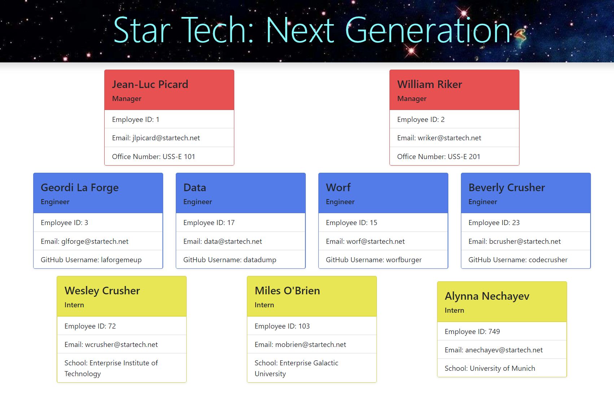

# Star Tech Profiles Generator

## Table of Contents
- [Description](#description)
- [Installation](#installation)
- [Usage](#usage)
- [Contributors](#contributors)
- [Testing](#testing)
- [Questions](#questions)
- [License](#license)

## Instructional Video
[Instructional Video](https://drive.google.com/file/d/1Wa_Lo4BhqAqUVIBHqLvVoCBXCohMMw2L/view?usp=sharing)

## Description
This application is a Node.js based profile generator to organize employees of an organization into cards on a webpage. The cards have general information for all employee types, which includes name, employee type (Manager, Engineer, or Intern), employee ID, and email. Depending on the specific type of employee, the cards will also include office number for Managers, GitHub user name for Engineers, and school for Interns. 

## Installation
As this program generates an HTML document based on inputs through Node.js, you will want to open an integrated terminal in the project folder. Before you can input employee information, you will need to ensure that you have node modules installed. Once you have node modules installed, you can then call the prompt to input employee data by typing "npm .\index.js" into the terminal and responding accordingly to the prompted questions. 

## Usage
In your explorations of new worlds and seeking out new life and civilizations, you need to be able to keep track of the team that is getting you there. This application makes it easy to input your team's information and have that accessible in one location. The types of employees are organized by a color scheme that makes it efficient to easily locate types of employees. Specifically, the cards for managers are red and at the top, the cards for engineers are blue and in the middle, and the cards for interns are yellow and at the bottom. This efficient system will make it easy to boldly go where no one has gone before!

Here is a screenshot of what the page will look like:

## Contributors
This project was developed by Adam Horn, with guidance from Ryan Skog.

## Testing
Testing can be conducted with the same use of the integrated terminal mentioned above when calling "npm test" in the terminal. This action will run jest on the four files in the "tests" folder: Employee.test.js, Engineer.test.js, Intern.test.js, and Manager.test.js. Should you decide to make any changes to the Classes files for each employee type in the "lib" folder, you will need to update the test files accordingly to ensure the tests pass. 

## Questions
GitHub username: [mradamhorn](https://github.com/mradamhorn)
Email address: mr.amhorn@gmail.com

## License
